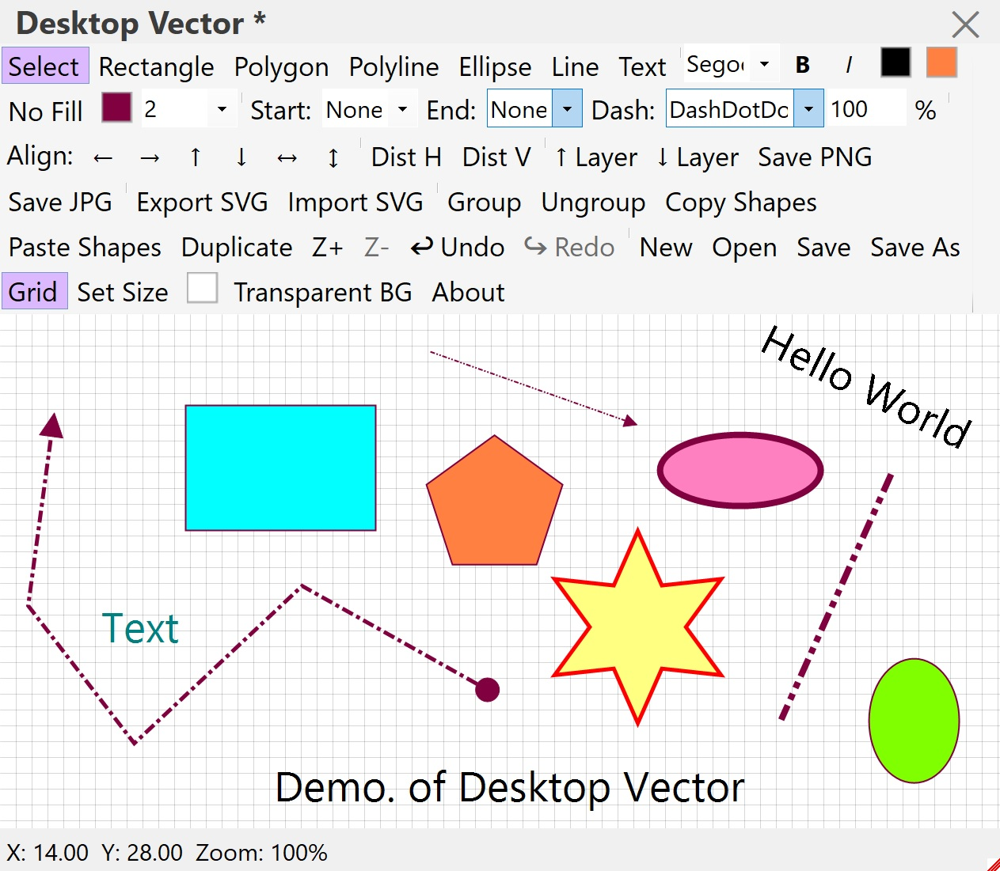
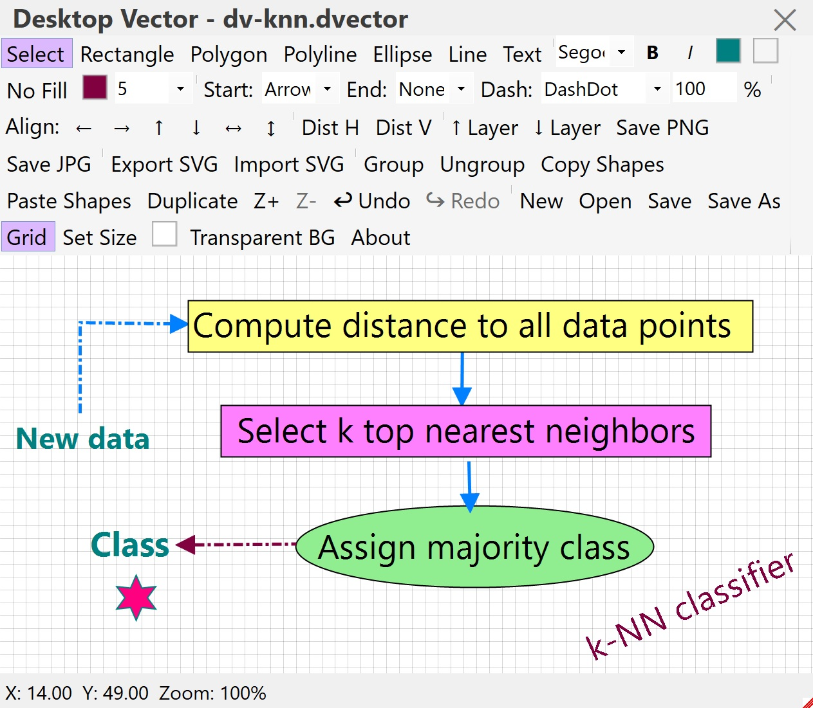

# 🖌️ Desktop Vector

**A lightweight, floating vector editor for Windows.**  
Draw, annotate, design diagrams, and export to SVG, PNG, or JPG — all in a clean, always‑on‑top window.

<table>
  <tr>

<td>
Figure 1: A snapshot of the app: DesktopVector, version 0.0, while working.</td>
    
<td>
Figure 2: Another snapshot of the app: DesktopVector, version 0.0, while working.</td>

  </tr>
</table>

---

## ✨ Features

- **Shapes** – Rectangle, Ellipse, Line, Polygon, Polyline, Text
- **Styling** – Fill, Stroke, Dash styles, Line caps (Arrow, Bullet, Diamond)
- **Editing** – Move, Resize, Rotate, Vertex editing (Polylines)
- **Selection** – Click, Shift‑click, Rubber‑band
- **Layers** – Bring Forward / Send Backward
- **Group / Ungroup**
- **Align & Distribute** – Left, Right, Top, Bottom, Center, Distribute
- **Undo / Redo** (30 steps)
- **Zoom** – Buttons + `Ctrl` + MouseWheel
- **Grid** – Toggle on/off
- **Canvas Background** – Solid colour or Transparent
- **Export** – SVG (with caps & dash), PNG (transparent or solid), JPG
- **Import** – SVG (with fill, text, polylines, polygons)
- **Native Project** – Save/Load `.dvector` files
- **Custom Title Bar & Resize Grip**
- **Always on Top** – Stays above other windows
- **System Tray** – Minimise to tray with Show/Exit

---

### Download
## This archive includes the executable program: **DesktopVector.exe**, which is suitable for **Windows 10** and over. You should click on the executable to run.
[Download the archive for win64](https://drive.google.com/file/d/1efNq5e_a9u5_SpfBS_HrVMMdzGNt4KWb/view?usp=sharing)

### Run
Launch `DesktopVector.exe`.  
The app appears as a floating window that stays on top of other applications.

---

## 🖱️ How to Use

| Action | How |
|--------|-----|
| **Move window** | Drag the title bar |
| **Resize** | Drag the bottom‑right grip |
| **Hide** | Click the ✕ button (hides to tray) |
| **Show** | Double‑click tray icon |
| **Select a tool** | Click a button in the toolbar |
| **Draw a shape** | Click on the canvas |
| **Select shapes** | Click or drag a rectangle (rubber‑band) |
| **Add to selection** | Hold `Shift` while clicking |
| **Move selected** | Drag the shape |
| **Resize** | Drag a blue handle |
| **Rotate** | Drag the green circle or hold `Ctrl` + drag |
| **Edit polyline** | Drag a red vertex; double‑click a segment to insert a point |

---

## ⌨️ Keyboard Shortcuts

| Keys | Action |
|------|--------|
| `Ctrl+Z` | Undo |
| `Ctrl+Y` | Redo |
| `Arrow keys' | Move shapes |
| `Delete` | Delete selected shape(s) |
| `Ctrl+G` | Group selected |
| `Ctrl+Shift+G` | Ungroup group |
| `Ctrl+C` | Copy selected shapes |
| `Ctrl+Shift+C` | Copy shapes (shape‑level) |
| `Ctrl+Shift+V` | Paste shapes (shape‑level) |
| `Ctrl+D` | Duplicate selected shapes |
| `Ctrl+N` | New Canvas |
| `Ctrl+O` | Open project |
| `Ctrl+S` | Save project |
| `Ctrl+Shift+S` | Save As |
| `Ctrl+` `+` / `-` | Zoom in/out |
| `Ctrl+MouseWheel` | Zoom in/out |
| `Enter` (text) | Commit text |
| `Escape` (text) | Cancel text input |

---

## 🌟 Show your support

If you like **Desktop Vector**, please consider giving it a ⭐ on GitHub – it means a lot!

---
